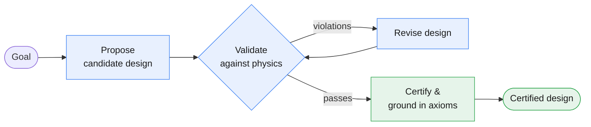
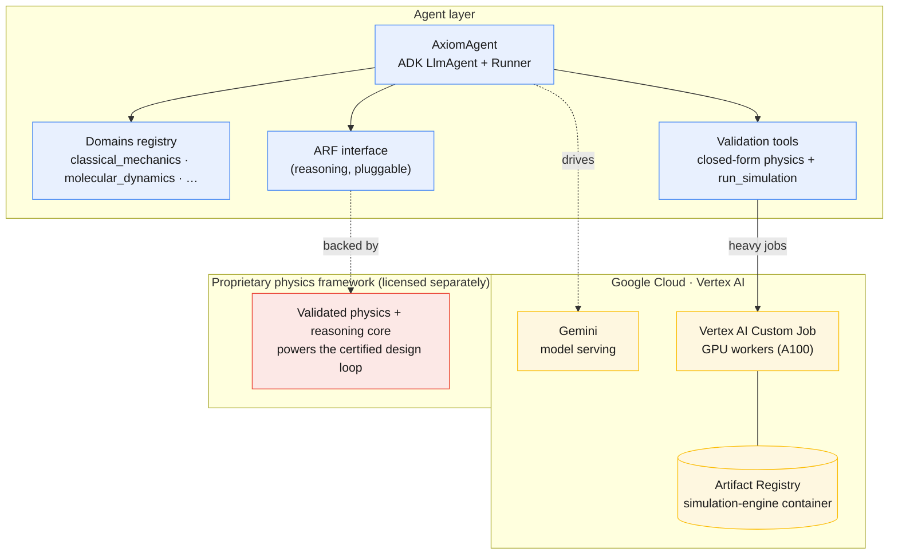

# Axiom Agent - Architecture Diagrams

GitHub renders these Mermaid diagrams inline. Link to this page from anywhere:
`docs/architecture-diagram.md`.

---

## 1. The design loop

How the agent turns a goal into a physics-certified design.

---

## 2. System architecture

The agent runs on Google Cloud / Vertex AI. Three pluggable boundaries
(domains, reasoning, compute) keep the agent code stable while the platform
scales.

---

## 3. Pluggable boundaries

Each boundary is an interface; the implementation behind it can be swapped
without touching agent code.

| Boundary | Interface | Ships in this repo | Production |
|---|---|---|---|
| Reasoning | `AxiomEngine` (`arf/`) | `ReferenceAxiomEngine` | Proprietary physics framework |
| Compute | `ComputeBackend` (`compute/`) | `LocalBackend` (review) | `VertexComputeBackend` (Vertex AI GPU) |
| Domains | `register_domain` (`domains/`) | `classical_mechanics`, `molecular_dynamics` | Any physics domain |
